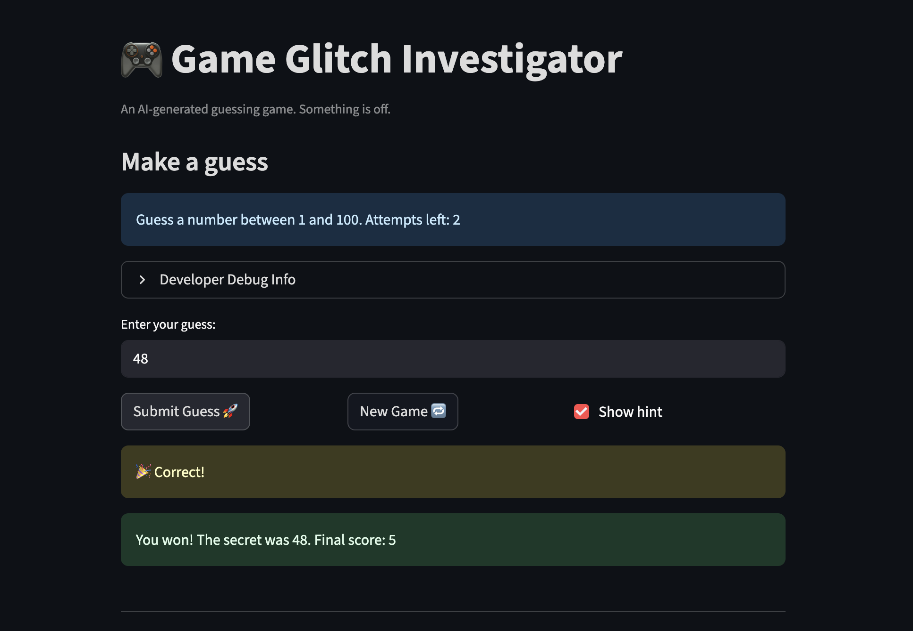

# 🎮 Game Glitch Investigator: The Impossible Guesser

## 🚨 The Situation

You asked an AI to build a simple "Number Guessing Game" using Streamlit.
It wrote the code, ran away, and now the game is unplayable. 

- You can't win.
- The hints lie to you.
- The secret number seems to have commitment issues.

## 🛠️ Setup

1. Install dependencies: `pip install -r requirements.txt`
2. Run the broken app: `python -m streamlit run app.py`

## 🕵️‍♂️ Your Mission

1. **Play the game.** Open the "Developer Debug Info" tab in the app to see the secret number. Try to win.
2. **Find the State Bug.** Why does the secret number change every time you click "Submit"? Ask ChatGPT: *"How do I keep a variable from resetting in Streamlit when I click a button?"*
3. **Fix the Logic.** The hints ("Higher/Lower") are wrong. Fix them.
4. **Refactor & Test.** - Move the logic into `logic_utils.py`.
   - Run `pytest` in your terminal.
   - Keep fixing until all tests pass!

## 📝 Document Your Experience

- [ ] Describe the game's purpose.
The game's purpose is to let the user play a guessing game focusing on guessing a secrect number with hint provided to help the user to decide whether to guess higher or lower.

- [ ] Detail which bugs you found.
There are multiple bugs I found which are the hints are backwards, sometime doesn't work at all. When my guess was too high, it told me to “go higher,” and when my guess was too low, it told me to “go lower,” which confused the gameplay. The secret number was being treated like a string while my guess was an integer. After losing, clicking New Game sometimes kept the app stuck in “Game over” mode and didn’t let me continue playing or see hints.The difficulty level is wrong too. Normal and hard mode are misplaced.Hard mode is actually easier than “Normal. When you select Hard, the secret number range becomes smaller instead of harder. The game always tells you “Guess a number between 1 and 100” even when difficulty changes.

- [ ] Explain what fixes you applied.
I updated check_guess so that it work correctly missmatched comparasio. If guess > secret it should returns “Too High” and tells the user to go LOWER, and if guess < secret it should tells the user to go HIGHER. I made sure the secret number is always treated as an integer using intst.session_state.secret and removing the code that converted it to a string, which removed the int vs str comparison error. I fixed the New Game issue by ensuring that when a new game is started, all relevant session state variables are reset to their initial values including generating a new secret number and resetting attempts, score, status, and history.

## 📸 Demo

- [ ] [Insert a screenshot of your fixed, winning game here]

## 🚀 Stretch Features

- [ ] [If you choose to complete Challenge 4, insert a screenshot of your Enhanced Game UI here]
